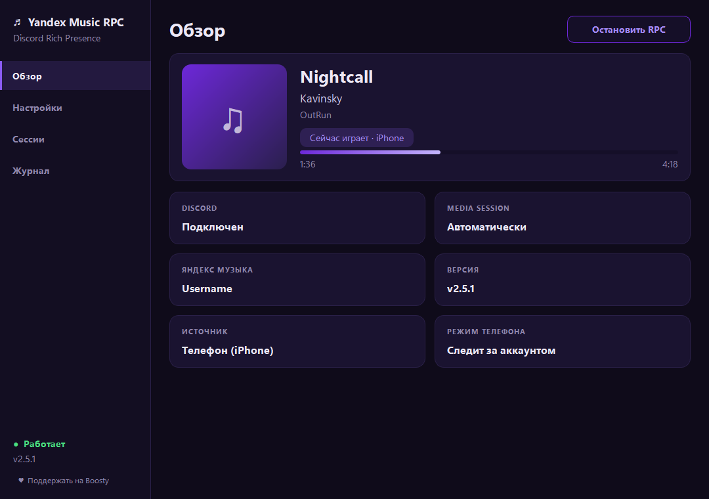

#  &nbsp;Yandex Music RPC: Яндекс Музыка в статусе Discord


**Discord Rich Presence для Яндекс Музыки на Windows.** Показывает в вашем профиле Discord, что вы слушаете: название трека, исполнителя, обложку, прогресс и паузу. Музыку можно слушать в приложении Яндекс Музыка на ПК или **на iPhone и Android** (режим телефона).

*English: a Discord Rich Presence (RPC) app for Yandex Music on Windows. It shows the track you are listening to in your Discord status, including music playing on your iPhone or Android phone. [Jump to English](#english).*

<p align="center">
  
</p>

[**⬇ Скачать последнюю версию**](../../releases/latest) · [Как это настроить](#быстрый-старт) · [Частые вопросы](#частые-вопросы) · [English](#english)

Это форк проекта [FozerG/WinYandexMusicRPC](https://github.com/FozerG/WinYandexMusicRPC) (лицензия MIT): оригинальное ядро, которое читает текущий трек из Windows Media Session и ищет его в Яндекс Музыке, сохранено и доработано. Подробнее в разделе [«Что изменено»](#что-изменено-относительно-оригинала).

> Неофициальный проект. Он не связан с Яндексом и Discord и опирается на неофициальные интерфейсы, которые могут измениться без предупреждения.

## Быстрый старт
Как показать Яндекс Музыку в статусе Discord:
1. Скачайте архив на странице [Releases](../../releases/latest) и распакуйте папку целиком.
2. Запустите `WinYandexMusicRPC.exe`, нажмите **«Запустить RPC»** и откройте Discord (классический клиент на ПК).
3. Включите трек в приложении Яндекс Музыка. Через пару секунд он появится в вашем профиле Discord.

Чтобы статус показывал музыку с телефона, войдите в аккаунт Яндекса: «Настройки» → «Войти / обновить токен». Подробности в разделе [«Режим телефона»](#режим-телефона).

## Возможности
- **Окно приложения** с текущим треком, обложкой и живым прогрессом, запуск и остановка RPC одной кнопкой, фиолетовая тема.
- **Статус «Слушает Яндекс Музыку»** с обложкой, временем до конца трека, паузой и кнопками «Открыть в браузере» / «Открыть в приложении».
- **Режим телефона:** если музыка играет на iPhone или Android, в Discord показывается этот трек с пометкой «(на телефоне)». Если играет ПК, источником остаётся он. См. [ниже](#режим-телефона).
- **Работа в трее:** крестик сворачивает окно, RPC продолжает работать. Полный выход через меню значка в трее. Второй запуск не плодит копии, а открывает уже работающее окно.
- **Автозапуск с Windows:** приложение стартует свёрнутым в трей и само включает RPC.
- **Вход в аккаунт Яндекса** (по желанию для ПК, нужен для режима телефона). Токен хранится в хранилище учётных данных Windows и не удаляется, пока вы сами не нажмёте «Выйти».
- Повтор одного трека, перемотка, пауза и смена трека отражаются в Discord корректно.
- Журнал работы в окне и в файле `%LOCALAPPDATA%\WinYandexMusicRPC\app.log`.

## Установка

### Готовая сборка
1. Скачайте архив с последним релизом на странице [Releases](../../releases/latest).
2. Распакуйте папку целиком (внутри `WinYandexMusicRPC.exe` и папка `_internal`) и запустите `WinYandexMusicRPC.exe`.
3. Нажмите «Запустить RPC» и откройте Discord. Для входа в аккаунт Яндекса: «Настройки» → «Войти / обновить токен».

### Из исходников
Нужны Windows 10/11, Python (проверено на 3.12) и установленный [Git](https://git-scm.com/) (две зависимости ставятся из GitHub).

```bat
pip install -r requirements.txt
python gui_app.py
```

### Сборка exe
```bat
pyinstaller --noconfirm gui_app.spec
```
Готовая папка появится в `dist/WinYandexMusicRPC/`. Проверить, что в сборку попали все модули, можно командой `WinYandexMusicRPC.exe --selftest`: результат запишется в `%LOCALAPPDATA%\WinYandexMusicRPC\selftest.txt`.

## Как это работает
Приложение читает текущий трек из Windows Media Session у приложения Яндекс Музыка, находит его в каталоге Яндекса (обложка, длительность, ссылка) и отправляет в Discord через локальный Rich Presence. Треки, которых нет в каталоге (например, загруженные вами файлы), публикуются по данным из тегов, без обложки. Из источников учитывается только приложение Яндекс Музыка; браузеры, Telegram и другие плееры игнорируются.

### Режим телефона
Включается галочкой в «Настройках» (по умолчанию включён) и требует входа в аккаунт Яндекса. Приложение следит за состоянием плеера вашего аккаунта через протокол Ynison (только чтение, управлять воспроизведением оно не умеет и не пытается) и, если играет телефон, показывает этот трек.

- Работает, пока на ПК запущены приложение с включённым RPC **и Discord**. Без включённого ПК режим телефона не работает.
- Если на ПК играет Яндекс Музыка, источником всегда остаётся ПК. Телефон берётся, только когда ПК не играет.
- Ynison является неофициальным интерфейсом, поэтому в `requirements.txt` закреплён проверенный коммит библиотеки `yandex-music`. Если Яндекс его изменит, режим может перестать работать.

### Настройки
| Параметр | Что делает |
|---|---|
| Тип активности | «Слушает» или «Играет» |
| Кнопки | Web, приложение, обе или без кнопок |
| Язык RPC | Русский или English (меняется и название карточки в Discord) |
| Точное совпадение | Требовать полного совпадения названия и исполнителя при поиске в каталоге |
| Режим телефона | См. выше |
| Запускать с Windows | Автозапуск в трее |

## Частые вопросы

**Как показать Яндекс Музыку в статусе Discord?**
Запустите приложение, нажмите «Запустить RPC» и включите музыку в приложении Яндекс Музыка. Пошагово: [Быстрый старт](#быстрый-старт).

**Статус не появляется. Что проверить?**
- Discord запущен на этом же ПК (классический клиент, не веб-версия).
- В настройках Discord (раздел про конфиденциальность активности) разрешён показ вашей активности.
- Нажата кнопка «Запустить RPC», а статус в левом нижнем углу окна показывает «Работает».
- Музыка играет в **приложении** Яндекс Музыка на ПК: браузеры и другие плееры не учитываются.
- Если вы пользуетесь приложением Яндекс Музыка, в его настройках выключена опция «Плавные переходы между треками».
- Подробности смотрите в журнале: вкладка «Журнал» или файл `%LOCALAPPDATA%\WinYandexMusicRPC\app.log`.

**Работает ли это с iPhone и Android?**
Да, но с оговоркой: приложение работает на Windows-ПК, а музыка при этом может играть на телефоне. ПК и Discord на нём должны быть включены. Без включённого ПК статус не появится. Подробнее: [Режим телефона](#режим-телефона).

**Нужно ли входить в аккаунт Яндекса?**
Для музыки на ПК обычно нет. Вход нужен для режима телефона и в случаях, когда каталог недоступен без авторизации (например, в некоторых регионах).

**Работает ли с Яндекс Музыкой в браузере, с Spotify, VK?**
В этой версии нет: учитывается только приложение Яндекс Музыка на Windows.

**Работает ли на macOS или Linux?**
Нет, только Windows 10 и 11.

**Безопасно ли это?**
Код открыт. Токен Яндекса хранится только у вас на компьютере, в хранилище учётных данных Windows, и нигде не записывается в журнал. Подробнее: [Конфиденциальность](#конфиденциальность).

## Известные ограничения
- Только Windows 10/11. С урезанными сборками Windows работа не гарантируется.
- Автор оригинала предупреждает: если вы используете приложение «Яндекс Музыка», отключите в его настройках опцию **«Плавные переходы между треками»**, иначе она может нарушить работу `Media.Control`.
- Если при нажатии «Запустить RPC» музыка уже играет на ПК, приложение один раз ставит её на паузу на долю секунды и включает снова: так оно получает актуальную позицию трека от Windows. При смене настроек этого не происходит.
- Название карточки «(на телефоне)» зависит от возможностей вашей версии Discord. Если Discord его не примет, будет показано стандартное название.

## Что изменено относительно оригинала
- Графический интерфейс (PyQt6), трей, автозапуск, единственный экземпляр.
- Режим телефона через Ynison.
- Исправлены зависания при повторе трека, при потере медиасессии и при остановке и повторном запуске, а также неверный прогресс и «залипание» карточки; убраны лишние запросы к каталогу.
- Отмена ожидания Discord, защита от бесконечных повторов ошибок, журнал в файл.
- Консольный режим (`main.py`), `main.spec` и `InnoScript.iss` остались от оригинала и относятся к старой консольной версии.

## English
**Yandex Music RPC** is a Discord Rich Presence (RPC) app for [Yandex Music](https://music.yandex.ru) on Windows 10/11. It shows the track you are listening to (title, artist, cover, progress, pause state) in your Discord profile as "Listening to Yandex Music".

- **Phone mode:** music playing on your **iPhone or Android** phone is shown too, labelled "(on phone)". The app runs on your Windows PC (with Discord open) and reads the playback state of your Yandex account through the unofficial Ynison protocol (read-only). If Yandex Music is playing on the PC, the PC is always the source.
- GUI, system tray, autostart with Windows, single instance, repeat-one and seek support.
- Only the Yandex Music **desktop app** is detected as a source; browsers and other players are ignored.
- Your Yandex token is stored only locally in Windows Credential Manager and is never written to the log.

**Quick start:** download the latest zip from [Releases](../../releases/latest), unpack the whole folder, run `WinYandexMusicRPC.exe`, click "Запустить RPC" (Start RPC) and open Discord. For phone mode sign in under Settings. The interface is in Russian. To run from source: `pip install -r requirements.txt`, then `python gui_app.py` (Python 3.12 and Git required).

Unofficial project, not affiliated with Yandex or Discord. Fork of [FozerG/WinYandexMusicRPC](https://github.com/FozerG/WinYandexMusicRPC) (MIT).

## Благодарности
- [FozerG](https://github.com/FozerG/WinYandexMusicRPC), автор оригинального проекта.
- [MarshalX/yandex-music-api](https://github.com/MarshalX/yandex-music-api), неофициальная библиотека для API Яндекс Музыки и Ynison.
- [pypresence](https://github.com/qwertyquerty/pypresence), Discord Rich Presence для Python.

## Конфиденциальность
- Токен Яндекса хранится только на вашем компьютере, в хранилище учётных данных Windows, и используется для запросов к Яндексу. «Выйти» в «Настройках» удаляет его.
- Приложение обращается к серверам Яндекса (поиск трека, обложка, состояние плеера для режима телефона) и к локальному клиенту Discord. Иконки «играет» и «пауза» Discord сам подгружает с GitHub.
- Журнал `app.log` лежит только у вас на диске; токен в него не записывается (видна только его длина).

## Баги и предложения
Нашли ошибку? Создайте [Issue](../../issues) и приложите журнал (`%LOCALAPPDATA%\WinYandexMusicRPC\app.log`), предварительно проверив, что в нём нет ничего личного.

## Поддержать проект
Если приложение вам пригодилось, можно поддержать разработку. Это совершенно необязательно:

[](https://boosty.to/yandexmusicrpc)

## Лицензия
[MIT](LICENSE). Оригинальное уведомление об авторских правах сохранено.
